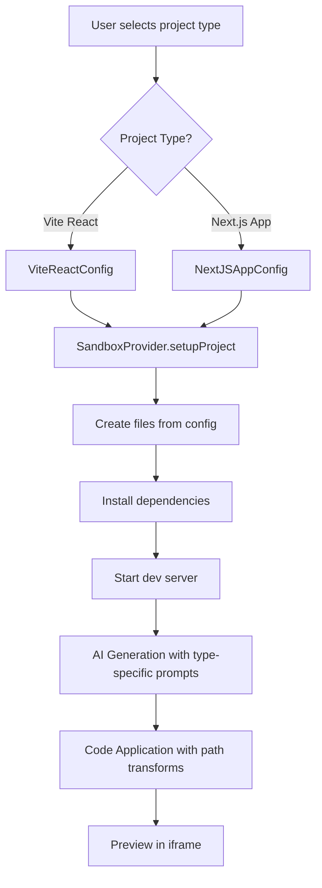

# Next.js Extension Plan for Open Lovable

## Executive Summary

This document outlines a modular architecture for extending Open Lovable to support Next.js applications alongside Vite + React. The design prioritizes backwards compatibility and clean abstraction layers.

## Current Architecture

```
Frontend (Hooks) → API Routes → Core Libraries
                                  ├── SandboxFactory/Provider
                                  ├── AI Provider Manager  
                                  └── Template Library
```

### Current Limitations
1. Hardcoded Vite setup in `e2b-provider.ts`
2. No project type abstraction
3. Vite-specific AI prompts
4. No API route generation support

---

## Proposed Architecture

### New Abstraction: ProjectType

```typescript
export type ProjectTypeId = 'vite-react' | 'nextjs-app' | 'nextjs-pages';

export interface ProjectTypeConfig {
  id: ProjectTypeId;
  name: string;
  sourceDir: string;        // 'src' for Vite, 'app' for Next.js
  componentsDir: string;    // 'src/components' or 'components'
  apiDir: string | null;    // null for Vite, 'app/api' for Next.js
  devCommand: string;
  devPort: number;          // 5173 for Vite, 3000 for Next.js
  baseDependencies: Record<string, string>;
  entryFiles: ProjectFile[];
  configFiles: ProjectFile[];
  filePathTransform: (path: string) => string;
}
```

---

## Implementation Phases

### Phase 1: Foundation (2-3 days)
- Create `lib/projects/project-type.ts` interface
- Create project type configs: `vite-react.ts`, `nextjs-app.ts`
- Create `ProjectTypeManager` class

### Phase 2: Sandbox Updates (2-3 days)
- Add `setupProject(config)` to SandboxProvider
- Implement `setupNextApp()` in E2BProvider
- Update sandbox creation API to accept project type

### Phase 3: AI Generation (3-4 days)
- Create modular system prompts in `lib/ai/system-prompts/`
- Add Next.js-specific instructions
- Enable API route generation

### Phase 4: Code Application (2 days)
- Transform file paths based on project type
- Handle Next.js-specific files (layout.tsx, page.tsx, route.ts)

### Phase 5: UI Integration (2 days)
- Add project type selector to home/generation pages
- Store project type in context

---

## Key File Changes

### New Files to Create

```
lib/projects/
  project-type.ts           # Core interface
  project-type-manager.ts   # Manager class
  project-types/
    vite-react.ts           # Vite config
    nextjs-app.ts           # Next.js App Router config

lib/ai/system-prompts/
  base-prompt.ts            # Shared rules
  vite-react-prompt.ts      # Vite-specific
  nextjs-app-prompt.ts      # Next.js-specific
```

### Files to Modify

| File | Changes |
|------|---------|
| `lib/sandbox/types.ts` | Add `setupProject()` abstract method |
| `lib/sandbox/providers/e2b-provider.ts` | Add `setupNextApp()` method |
| `app/api/create-ai-sandbox-v2/route.ts` | Accept project type param |
| `app/api/generate-ai-code-stream/route.ts` | Use modular prompts |
| `app/api/apply-ai-code-stream/route.ts` | Transform paths by project type |
| `config/app.config.ts` | Add Next.js config section |

---

## Next.js File Structure

```
/app
  layout.tsx          # Root layout (required)
  page.tsx            # Home page
  globals.css         # Global styles
  /dashboard
    page.tsx          # /dashboard route
  /api
    /users
      route.ts        # API: GET/POST /api/users
/components
  Header.tsx          # Shared components
  Footer.tsx
/lib
  utils.ts            # Utilities
/public               # Static assets
```

---

## API Route Generation

Next.js API routes use the App Router pattern:

```typescript
// app/api/users/route.ts
import { NextRequest, NextResponse } from 'next/server';

export async function GET(request: NextRequest) {
  return NextResponse.json({ users: [] });
}

export async function POST(request: NextRequest) {
  const body = await request.json();
  return NextResponse.json({ created: body }, { status: 201 });
}
```

The AI will be instructed to:
1. Place API routes in `app/api/[name]/route.ts`
2. Export HTTP method handlers (GET, POST, PUT, DELETE)
3. Use NextRequest/NextResponse types
4. Return proper status codes

---

## Migration Path

### Backwards Compatibility

```typescript
// SandboxProvider - keep old methods for compat
async setupViteApp(): Promise<void> {
  return this.setupProject(getProjectType('vite-react'));
}

async restartViteServer(): Promise<void> {
  return this.restartDevServer(getProjectType('vite-react'));
}
```

### Default Behavior
- New projects default to current behavior (Vite + React)
- Next.js is opt-in via project type selector

---

## Mermaid Diagram: Flow



---

## Testing Strategy

1. **Unit Tests**: Project type configs, path transforms
2. **Integration Tests**: Sandbox setup for each project type
3. **E2E Tests**: Full generation flow for Next.js
4. **API Route Tests**: Verify generated endpoints work

---

## Estimated Timeline

| Phase | Duration | Dependencies |
|-------|----------|--------------|
| Phase 1: Foundation | 2-3 days | None |
| Phase 2: Sandbox | 2-3 days | Phase 1 |
| Phase 3: AI Generation | 3-4 days | Phase 1 |
| Phase 4: Code Application | 2 days | Phase 2, 3 |
| Phase 5: UI | 2 days | Phase 4 |
| Phase 6: Testing | 2-3 days | All phases |

**Total: ~15-20 days**

---

## Success Criteria

1. Users can select Next.js as project type
2. Generated Next.js apps run correctly in sandbox
3. API routes can be generated and tested
4. Existing Vite + React flow unchanged
5. Clean separation of concerns in codebase