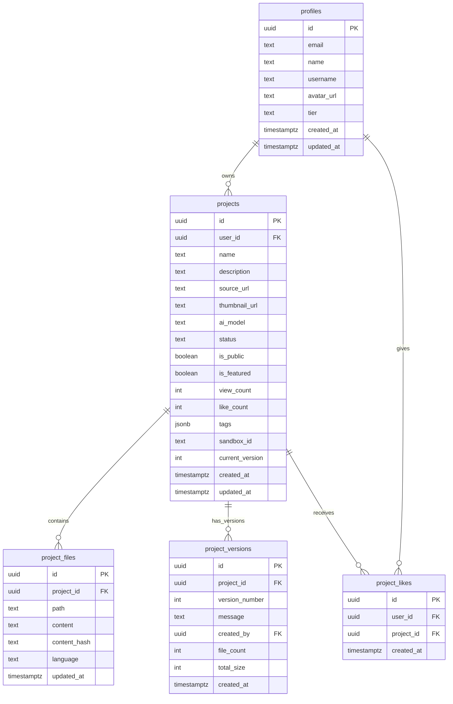

# Open Lovable SaaS Enhancement Plan

## Overview

Transform the Open Lovable AI website builder into a full SaaS platform with:
- **Supabase backend** - PostgreSQL database, Auth, Storage, Edge Functions
- **GitHub OAuth authentication** via Supabase Auth
- **User workspaces** with persistent projects
- **Multiple projects per user** with version history
- **Public showcase gallery** for featured creations
- **Marketing landing page** with SaaS features

---

## Technology Stack

| Layer | Technology |
|-------|------------|
| **Backend** | Supabase (PostgreSQL, Auth, Storage, Edge Functions) |
| **Database** | PostgreSQL (via Supabase) |
| **Authentication** | Supabase Auth + GitHub OAuth |
| **File Storage** | Supabase Storage (for thumbnails) |
| **Framework** | Next.js 15 (App Router) |
| **UI** | React 19, Tailwind CSS |
| **State** | Zustand + React Query |

---

## Current State Analysis

### What Already Exists

| Component | Status | Location |
|-----------|--------|----------|
| GitHub OAuth | ⚠️ NextAuth (will migrate) | `lib/auth/auth-options.ts` |
| Auth Button | ⚠️ NextAuth (will update) | `components/github/AuthButton.tsx` |
| User Menu | ⚠️ NextAuth (will update) | `components/github/UserMenu.tsx` |
| Session Provider | ⚠️ NextAuth (will replace) | `components/providers/SessionProvider.tsx` |
| Project Types | ✅ Defined | `lib/projects/types.ts` |
| Local Project Store | ⚠️ localStorage only | `lib/projects/project-store.ts` |
| GitHub Store | ✅ Zustand | `lib/stores/github-store.ts` |
| Landing Page | ⚠️ Basic | `app/page.tsx` |

### What Needs Implementation

1. **Supabase integration** - Replace NextAuth with Supabase Auth
2. **Database layer** - Replace localStorage with Supabase PostgreSQL
3. **User workspace** - Dashboard with project management
4. **Project visibility** - Public/private toggle
5. **Showcase gallery** - Public project discovery
6. **Storage** - Supabase Storage for thumbnails
7. **Enhanced landing** - SaaS marketing features

---

## Architecture Design

### System Architecture

```mermaid
flowchart TB
    subgraph Client[Frontend - Next.js 15]
        LP[Landing Page /]
        SC[Showcase /showcase]
        DB[Dashboard /dashboard]
        GN[Generation /generation]
        PV[Project View /projects/id]
    end

    subgraph Supabase[Supabase Platform]
        SA[Supabase Auth]
        GH[GitHub OAuth]
        PG[PostgreSQL]
        ST[Supabase Storage]
        EF[Edge Functions]
    end

    subgraph API[Next.js API Routes]
        PA[/api/projects]
        UA[/api/users]
        AA[/api/auth/callback]
        SH[/api/showcase]
    end

    Client --> SA
    SA --> GH
    Client --> API
    API --> PG
    API --> ST
    Client --> EF
```

### Database Schema (Supabase PostgreSQL)



**Note:** Supabase Auth handles `auth.users` table automatically. We create a `profiles` table that references it.

---

## Route Structure

### Public Routes
| Route | Description |
|-------|-------------|
| `/` | Marketing landing page |
| `/showcase` | Public project gallery |
| `/showcase/[id]` | Public project detail view |
| `/auth/signin` | GitHub OAuth sign-in |

### Protected Routes (require auth)
| Route | Description |
|-------|-------------|
| `/dashboard` | User workspace with project list |
| `/projects/[id]` | Project detail/edit page |
| `/projects/[id]/settings` | Project settings (visibility, etc.) |
| `/generation` | AI generation page (enhanced) |
| `/settings` | User account settings |

### API Routes
| Route | Methods | Description |
|-------|---------|-------------|
| `/api/auth/callback` | GET | Supabase OAuth callback |
| `/api/projects` | GET, POST | List/create projects |
| `/api/projects/[id]` | GET, PATCH, DELETE | Project CRUD |
| `/api/projects/[id]/files` | GET, PUT | Project files |
| `/api/projects/[id]/publish` | POST | Make project public |
| `/api/projects/[id]/fork` | POST | Fork public project |
| `/api/showcase` | GET | Public projects feed |
| `/api/showcase/featured` | GET | Featured projects |
| `/api/users/me` | GET, PATCH | Current user profile |

---

## Implementation Phases

### Phase 1: Supabase Foundation (Priority: Critical)

**Goal:** Set up Supabase and migrate from NextAuth to Supabase Auth

#### 1.1 Install Supabase packages
```bash
npm install @supabase/supabase-js @supabase/ssr
```

#### 1.2 Create Supabase project
1. Go to [supabase.com](https://supabase.com)
2. Create new project
3. Note the Project URL and anon key
4. Enable GitHub OAuth in Authentication > Providers
5. Set callback URL to: `https://your-project.supabase.co/auth/v1/callback`

#### 1.3 Configure environment variables
Add to `.env.local`:
```env
NEXT_PUBLIC_SUPABASE_URL=https://your-project.supabase.co
NEXT_PUBLIC_SUPABASE_ANON_KEY=your-anon-key
SUPABASE_SERVICE_ROLE_KEY=your-service-role-key
```

#### 1.4 Create database schema
Run in Supabase SQL Editor:

```sql
-- Enable UUID extension
create extension if not exists "uuid-ossp";

-- Profiles table (extends auth.users)
create table public.profiles (
  id uuid references auth.users on delete cascade primary key,
  email text unique,
  name text,
  username text unique,
  avatar_url text,
  tier text default 'free' check (tier in ('free', 'pro', 'enterprise')),
  created_at timestamptz default now(),
  updated_at timestamptz default now()
);

-- Projects table
create table public.projects (
  id uuid default uuid_generate_v4() primary key,
  user_id uuid references public.profiles on delete cascade not null,
  name text not null,
  description text,
  source_url text,
  thumbnail_url text,
  ai_model text not null,
  status text default 'draft' check (status in ('draft', 'generating', 'complete', 'error')),
  is_public boolean default false,
  is_featured boolean default false,
  view_count int default 0,
  like_count int default 0,
  tags jsonb default '[]'::jsonb,
  sandbox_id text,
  current_version int default 0,
  created_at timestamptz default now(),
  updated_at timestamptz default now()
);

-- Project files table
create table public.project_files (
  id uuid default uuid_generate_v4() primary key,
  project_id uuid references public.projects on delete cascade not null,
  path text not null,
  content text not null,
  content_hash text not null,
  language text,
  updated_at timestamptz default now(),
  unique(project_id, path)
);

-- Project versions table
create table public.project_versions (
  id uuid default uuid_generate_v4() primary key,
  project_id uuid references public.projects on delete cascade not null,
  version_number int not null,
  message text not null,
  created_by uuid references public.profiles,
  file_count int not null,
  total_size int not null,
  created_at timestamptz default now(),
  unique(project_id, version_number)
);

-- Project likes table
create table public.project_likes (
  id uuid default uuid_generate_v4() primary key,
  user_id uuid references public.profiles on delete cascade not null,
  project_id uuid references public.projects on delete cascade not null,
  created_at timestamptz default now(),
  unique(user_id, project_id)
);

-- Indexes for performance
create index projects_user_id_idx on public.projects(user_id);
create index projects_is_public_idx on public.projects(is_public, is_featured);
create index project_files_project_id_idx on public.project_files(project_id);
create index project_likes_project_id_idx on public.project_likes(project_id);

-- Row Level Security (RLS) policies
alter table public.profiles enable row level security;
alter table public.projects enable row level security;
alter table public.project_files enable row level security;
alter table public.project_versions enable row level security;
alter table public.project_likes enable row level security;

-- Profiles policies
create policy "Public profiles are viewable by everyone"
  on public.profiles for select using (true);

create policy "Users can update own profile"
  on public.profiles for update using (auth.uid() = id);

-- Projects policies
create policy "Public projects are viewable by everyone"
  on public.projects for select using (is_public = true or auth.uid() = user_id);

create policy "Users can create own projects"
  on public.projects for insert with check (auth.uid() = user_id);

create policy "Users can update own projects"
  on public.projects for update using (auth.uid() = user_id);

create policy "Users can delete own projects"
  on public.projects for delete using (auth.uid() = user_id);

-- Project files policies
create policy "Project files follow project visibility"
  on public.project_files for select using (
    exists (
      select 1 from public.projects
      where id = project_id and (is_public = true or auth.uid() = user_id)
    )
  );

create policy "Users can manage own project files"
  on public.project_files for all using (
    exists (
      select 1 from public.projects
      where id = project_id and auth.uid() = user_id
    )
  );

-- Project versions policies
create policy "Project versions follow project visibility"
  on public.project_versions for select using (
    exists (
      select 1 from public.projects
      where id = project_id and (is_public = true or auth.uid() = user_id)
    )
  );

-- Project likes policies
create policy "Anyone can view likes"
  on public.project_likes for select using (true);

create policy "Users can manage own likes"
  on public.project_likes for all using (auth.uid() = user_id);

-- Function to handle new user signup
create or replace function public.handle_new_user()
returns trigger as $$
begin
  insert into public.profiles (id, email, name, username, avatar_url)
  values (
    new.id,
    new.email,
    new.raw_user_meta_data->>'name',
    new.raw_user_meta_data->>'user_name',
    new.raw_user_meta_data->>'avatar_url'
  );
  return new;
end;
$$ language plpgsql security definer;

-- Trigger to auto-create profile on signup
create trigger on_auth_user_created
  after insert on auth.users
  for each row execute procedure public.handle_new_user();

-- Function to update updated_at timestamp
create or replace function public.update_updated_at_column()
returns trigger as $$
begin
  new.updated_at = now();
  return new;
end;
$$ language plpgsql;

-- Triggers for updated_at
create trigger update_profiles_updated_at
  before update on public.profiles
  for each row execute procedure public.update_updated_at_column();

create trigger update_projects_updated_at
  before update on public.projects
  for each row execute procedure public.update_updated_at_column();
```

#### 1.5 Set up Supabase Storage
1. Go to Storage in Supabase dashboard
2. Create bucket named `thumbnails`
3. Set as public bucket
4. Add policy to allow authenticated users to upload

#### 1.6 Create Supabase client utilities

**File: `lib/supabase/client.ts`** (browser client)
```typescript
import { createBrowserClient } from '@supabase/ssr'

export function createClient() {
  return createBrowserClient(
    process.env.NEXT_PUBLIC_SUPABASE_URL!,
    process.env.NEXT_PUBLIC_SUPABASE_ANON_KEY!
  )
}
```

**File: `lib/supabase/server.ts`** (server client)
```typescript
import { createServerClient } from '@supabase/ssr'
import { cookies } from 'next/headers'

export async function createClient() {
  const cookieStore = await cookies()

  return createServerClient(
    process.env.NEXT_PUBLIC_SUPABASE_URL!,
    process.env.NEXT_PUBLIC_SUPABASE_ANON_KEY!,
    {
      cookies: {
        getAll() {
          return cookieStore.getAll()
        },
        setAll(cookiesToSet) {
          try {
            cookiesToSet.forEach(({ name, value, options }) =>
              cookieStore.set(name, value, options)
            )
          } catch {
            // Called from Server Component
          }
        },
      },
    }
  )
}
```

**File: `lib/supabase/middleware.ts`** (for middleware)
```typescript
import { createServerClient } from '@supabase/ssr'
import { NextResponse, type NextRequest } from 'next/server'

export async function updateSession(request: NextRequest) {
  let supabaseResponse = NextResponse.next({ request })

  const supabase = createServerClient(
    process.env.NEXT_PUBLIC_SUPABASE_URL!,
    process.env.NEXT_PUBLIC_SUPABASE_ANON_KEY!,
    {
      cookies: {
        getAll() {
          return request.cookies.getAll()
        },
        setAll(cookiesToSet) {
          cookiesToSet.forEach(({ name, value }) => request.cookies.set(name, value))
          supabaseResponse = NextResponse.next({ request })
          cookiesToSet.forEach(({ name, value, options }) =>
            supabaseResponse.cookies.set(name, value, options)
          )
        },
      },
    }
  )

  const { data: { user } } = await supabase.auth.getUser()

  return { supabaseResponse, user }
}
```

#### 1.7 Create auth callback route

**File: `app/auth/callback/route.ts`**
```typescript
import { createClient } from '@/lib/supabase/server'
import { NextResponse } from 'next/server'

export async function GET(request: Request) {
  const { searchParams, origin } = new URL(request.url)
  const code = searchParams.get('code')
  const next = searchParams.get('next') ?? '/dashboard'

  if (code) {
    const supabase = await createClient()
    const { error } = await supabase.auth.exchangeCodeForSession(code)
    if (!error) {
      return NextResponse.redirect(`${origin}${next}`)
    }
  }

  return NextResponse.redirect(`${origin}/auth/error`)
}
```

#### 1.8 Create middleware for protected routes

**File: `middleware.ts`**
```typescript
import { type NextRequest } from 'next/server'
import { updateSession } from '@/lib/supabase/middleware'

const protectedRoutes = ['/dashboard', '/projects', '/settings', '/generation']
const authRoutes = ['/auth/signin']

export async function middleware(request: NextRequest) {
  const { supabaseResponse, user } = await updateSession(request)
  const { pathname } = request.nextUrl

  // Redirect to dashboard if authenticated user visits auth pages
  if (authRoutes.some(route => pathname.startsWith(route)) && user) {
    return Response.redirect(new URL('/dashboard', request.url))
  }

  // Redirect to sign-in if unauthenticated user visits protected pages
  if (protectedRoutes.some(route => pathname.startsWith(route)) && !user) {
    return Response.redirect(new URL('/auth/signin', request.url))
  }

  return supabaseResponse
}

export const config = {
  matcher: [
    '/((?!_next/static|_next/image|favicon.ico|.*\\.(?:svg|png|jpg|jpeg|gif|webp)$).*)',
  ],
}
```

---

### Phase 2: User Dashboard (Priority: High)

**Goal:** Build user workspace for managing projects

#### New Files Structure:
```
app/
├── dashboard/
│   ├── page.tsx              # Main dashboard
│   ├── layout.tsx            # Dashboard layout with sidebar
│   └── loading.tsx           # Loading state
├── projects/
│   ├── [id]/
│   │   ├── page.tsx          # Project detail
│   │   ├── settings/
│   │   │   └── page.tsx      # Project settings
│   │   └── loading.tsx
│   └── new/
│       └── page.tsx          # New project wizard
components/
├── dashboard/
│   ├── ProjectCard.tsx       # Project card in grid
│   ├── ProjectList.tsx       # Project list/grid view
│   ├── Sidebar.tsx           # Dashboard sidebar
│   ├── Stats.tsx             # User statistics
│   └── EmptyState.tsx        # No projects state
```

#### Dashboard UI Wireframe:
```
┌─────────────────────────────────────────────────────────────────┐
│  Logo   Dashboard  Projects  Showcase          [User Menu]      │
├─────────┬───────────────────────────────────────────────────────┤
│         │  Welcome back, {name}!                                │
│  Quick  │  ─────────────────────────────────────────────────────│
│  Stats  │  Your Projects                    [+ New Project]     │
│         │                                                       │
│ • 5     │  ┌──────────┐ ┌──────────┐ ┌──────────┐ ┌──────────┐ │
│ Projects│  │ Thumbnail│ │ Thumbnail│ │ Thumbnail│ │ Thumbnail│ │
│         │  │          │ │          │ │          │ │          │ │
│ • 1.2k  │  │ Project1 │ │ Project2 │ │ Project3 │ │ Project4 │ │
│  Views  │  │ 🔒 Draft │ │ 🌐 Public│ │ 🔒 Draft │ │ 🌐 Public│ │
│         │  │ 3 days   │ │ 1 week   │ │ Today    │ │ 2 weeks  │ │
│ • 45    │  └──────────┘ └──────────┘ └──────────┘ └──────────┘ │
│  Likes  │                                                       │
└─────────┴───────────────────────────────────────────────────────┘
```

---

### Phase 3: Public Showcase (Priority: High)

**Goal:** Create public gallery for discovering community projects

#### New Files Structure:
```
app/
├── showcase/
│   ├── page.tsx              # Showcase gallery
│   ├── [id]/
│   │   └── page.tsx          # Public project view
│   └── loading.tsx
components/
├── showcase/
│   ├── ShowcaseGrid.tsx      # Project grid
│   ├── ShowcaseCard.tsx      # Project card
│   ├── FeaturedBanner.tsx    # Featured projects carousel
│   ├── SearchFilter.tsx      # Search and filter controls
│   └── ProjectPreview.tsx    # Expanded preview modal
```

#### Showcase UI Wireframe:
```
┌─────────────────────────────────────────────────────────────────┐
│  Logo   Dashboard  Projects  Showcase          [User Menu]      │
├─────────────────────────────────────────────────────────────────┤
│                     Community Showcase                          │
│            Discover amazing projects built with AI              │
│                                                                 │
│  Featured ───────────────────────────────────────────────────── │
│  ┌─────────────────────────────────────────────────────────────┐│
│  │  [Featured Project Banner - Large Thumbnail + Title]        ││
│  │  Landing page for a fitness app with stunning animations    ││
│  │  by @username • ❤️ 234 likes • 👁 1.2k views               ││
│  └─────────────────────────────────────────────────────────────┘│
│                                                                 │
│  [🔍 Search...]  [Category ▾]  [Sort: Popular ▾]               │
│                                                                 │
│  All Projects ─────────────────────────────────────────────────│
│  ┌──────────┐ ┌──────────┐ ┌──────────┐ ┌──────────┐          │
│  │Thumbnail │ │Thumbnail │ │Thumbnail │ │Thumbnail │          │
│  │ Project  │ │ Project  │ │ Project  │ │ Project  │          │
│  │ @user    │ │ @user    │ │ @user    │ │ @user    │          │
│  │ ❤️ 12    │ │ ❤️ 45    │ │ ❤️ 8     │ │ ❤️ 103   │          │
│  └──────────┘ └──────────┘ └──────────┘ └──────────┘          │
│                                                                 │
│  [Load More]                                                    │
└─────────────────────────────────────────────────────────────────┘
```

---

### Phase 4: Enhanced Landing Page (Priority: Medium)

**Goal:** Create marketing-focused landing page for SaaS

#### Landing Page Sections:
1. **Hero** - Main value proposition + CTA
2. **Social Proof** - "Trusted by X developers"
3. **Features** - Key capabilities
4. **How It Works** - 3-step process
5. **Showcase Preview** - Sample of public projects
6. **FAQ**
7. **Footer** - Links, social

---

### Phase 5: Integration & Polish (Priority: Medium)

#### Tasks:
1. **Update Generation Page**
   - Save projects automatically to Supabase
   - Link to user's dashboard
   - Add "Save" and "Publish" buttons

2. **Thumbnail Generation**
   - Capture screenshot on project save
   - Upload to Supabase Storage

3. **Project Forking**
   - Allow copying public projects
   - Attribute original creator

4. **Navigation Update**
   - Show different links based on auth state
   - Add user menu to all pages

---

## Environment Variables (Complete)

```env
# =================================================================================
# SUPABASE (Required for SaaS features)
# =================================================================================
NEXT_PUBLIC_SUPABASE_URL=https://your-project.supabase.co
NEXT_PUBLIC_SUPABASE_ANON_KEY=eyJhbGciOiJIUzI1NiIsInR5cCI6IkpXVCJ9...
SUPABASE_SERVICE_ROLE_KEY=eyJhbGciOiJIUzI1NiIsInR5cCI6IkpXVCJ9...

# GitHub OAuth is configured in Supabase Dashboard:
# Authentication > Providers > GitHub
# Callback URL: https://your-project.supabase.co/auth/v1/callback

# =================================================================================
# AI PROVIDERS (existing - unchanged)
# =================================================================================
FIRECRAWL_API_KEY=...
ANTHROPIC_API_KEY=...
OPENAI_API_KEY=...
GEMINI_API_KEY=...
GROQ_API_KEY=...

# =================================================================================
# SANDBOX PROVIDERS (existing - unchanged)
# =================================================================================
SANDBOX_PROVIDER=vercel
VERCEL_OIDC_TOKEN=...
```

---

## Migration from NextAuth

The existing NextAuth implementation will be replaced with Supabase Auth:

| Before (NextAuth) | After (Supabase) |
|-------------------|------------------|
| `next-auth` package | `@supabase/ssr` |
| `lib/auth/auth-options.ts` | `lib/supabase/server.ts` |
| `SessionProvider` | `SupabaseProvider` |
| `useSession()` hook | Custom `useUser()` hook |
| `/api/auth/[...nextauth]` | `/auth/callback` |
| `getServerSession()` | `supabase.auth.getUser()` |

---

## Success Metrics

| Metric | Target | Tracking |
|--------|--------|----------|
| User sign-ups | Track growth | Supabase Auth dashboard |
| Projects created | Per user average | SQL query |
| Public projects | % of total | SQL query |
| Showcase views | Engagement | `view_count` column |
| Project forks | Community activity | Track via forked projects |
| Likes | Engagement | `project_likes` table |

---

## Next Steps

1. ✅ Plan approved with Supabase backend
2. Switch to **Code mode** to implement Phase 1
3. Create Supabase project and configure GitHub OAuth
4. Run SQL schema in Supabase
5. Implement client utilities and auth flow
6. Build dashboard and showcase pages
7. Update generation page to save projects