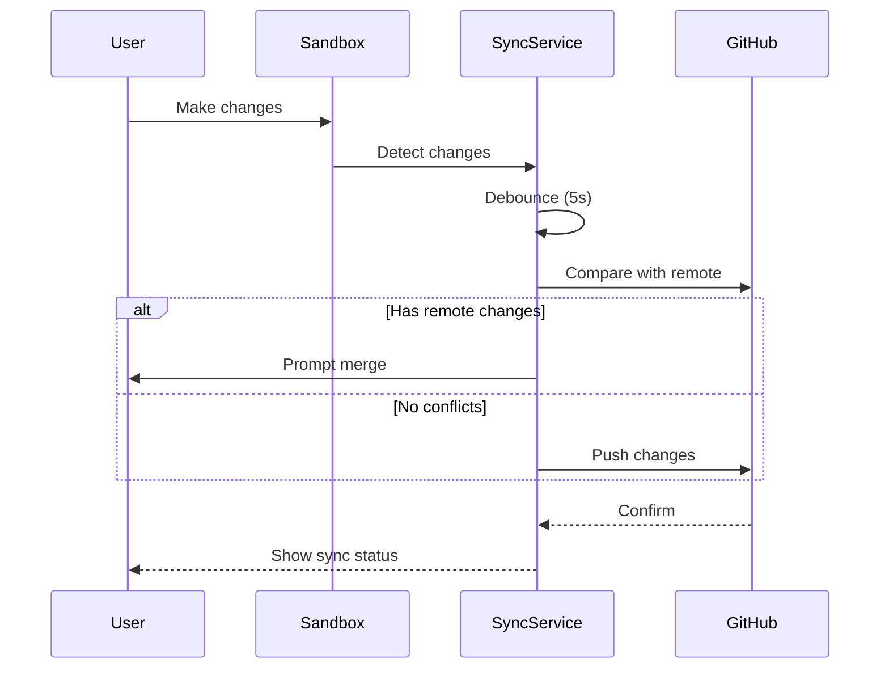

# GitHub Integration Architecture

## Status: ✅ Implemented

This document describes the GitHub integration architecture for Open Lovable, which provides project storage, authentication, and checkpoint functionality.

## Overview

This document outlines the architecture for integrating GitHub as the primary project storage and authentication mechanism for Open Lovable. Users will authenticate via GitHub OAuth, browse their repositories, and work on projects with automatic syncing and checkpoint capabilities.

## Key Features

1. **GitHub OAuth Authentication** - Login with GitHub, access user's repositories
2. **Repository Browser** - Browse and select repos that have a `package.json`
3. **Project Sync** - Bidirectional sync between sandbox and GitHub
4. **Checkpoints** - Create commits at key points during development
5. **Auto-Save** - Automatic commits on significant changes

---

## Architecture Diagram

```mermaid
flowchart TB
    subgraph Frontend
        LoginBtn[Login Button]
        UserMenu[User Menu]
        RepoSelector[Repo Selector]
        CheckpointUI[Checkpoint Panel]
    end

    subgraph NextAuth
        AuthConfig[NextAuth Config]
        GitHubProvider[GitHub Provider]
        SessionHandler[Session Handler]
    end

    subgraph API Routes
        AuthAPI[/api/auth/*]
        GitHubAPI[/api/github/*]
        ProjectAPI[/api/projects/*]
    end

    subgraph Services
        GitHubClient[GitHub Client - Octokit]
        ProjectSync[Project Sync Service]
        CheckpointManager[Checkpoint Manager]
    end

    subgraph External
        GitHub[GitHub API]
        GitHubOAuth[GitHub OAuth]
    end

    LoginBtn --> AuthAPI
    AuthAPI --> GitHubProvider
    GitHubProvider --> GitHubOAuth
    
    RepoSelector --> GitHubAPI
    GitHubAPI --> GitHubClient
    GitHubClient --> GitHub
    
    CheckpointUI --> ProjectAPI
    ProjectAPI --> CheckpointManager
    CheckpointManager --> GitHubClient
    
    ProjectSync --> GitHubClient
```

---

## 1. Authentication Layer

### 1.1 NextAuth.js Configuration

```typescript
// app/api/auth/[...nextauth]/route.ts
import NextAuth from 'next-auth';
import GitHubProvider from 'next-auth/providers/github';

const handler = NextAuth({
  providers: [
    GitHubProvider({
      clientId: process.env.GITHUB_CLIENT_ID!,
      clientSecret: process.env.GITHUB_CLIENT_SECRET!,
      authorization: {
        params: {
          scope: 'read:user user:email repo',
        },
      },
    }),
  ],
  callbacks: {
    async jwt({ token, account }) {
      if (account) {
        token.accessToken = account.access_token;
      }
      return token;
    },
    async session({ session, token }) {
      session.accessToken = token.accessToken as string;
      return session;
    },
  },
});

export { handler as GET, handler as POST };
```

### 1.2 Required Scopes

| Scope | Purpose |
|-------|---------|
| `read:user` | Read user profile info |
| `user:email` | Access user's email |
| `repo` | Full repo access (read/write) |

### 1.3 Session Types

```typescript
// types/next-auth.d.ts
import 'next-auth';

declare module 'next-auth' {
  interface Session {
    accessToken?: string;
    user: {
      id: string;
      name?: string;
      email?: string;
      image?: string;
    };
  }
}
```

---

## 2. GitHub Client Service

### 2.1 Core Client

```typescript
// lib/github/github-client.ts
import { Octokit } from '@octokit/rest';

export class GitHubClient {
  private octokit: Octokit;

  constructor(accessToken: string) {
    this.octokit = new Octokit({ auth: accessToken });
  }

  // List user's repos with package.json
  async listRepos(): Promise<Repository[]>;
  
  // Get repo contents
  async getRepoContents(owner: string, repo: string, path?: string): Promise<FileTree>;
  
  // Get file content
  async getFile(owner: string, repo: string, path: string): Promise<FileContent>;
  
  // Create/update file
  async upsertFile(owner: string, repo: string, path: string, content: string, message: string, sha?: string): Promise<void>;
  
  // Create commit with multiple files
  async createCommit(owner: string, repo: string, files: FileChange[], message: string): Promise<Commit>;
  
  // Get branches
  async getBranches(owner: string, repo: string): Promise<Branch[]>;
  
  // Get commits
  async getCommits(owner: string, repo: string, branch?: string): Promise<Commit[]>;
}
```

### 2.2 Types

```typescript
// lib/github/types.ts
export interface Repository {
  id: number;
  name: string;
  full_name: string;
  owner: { login: string };
  private: boolean;
  default_branch: string;
  description?: string;
  html_url: string;
  pushed_at: string;
  hasPackageJson?: boolean;
}

export interface FileTree {
  path: string;
  type: 'file' | 'dir';
  size?: number;
  sha: string;
  children?: FileTree[];
}

export interface FileContent {
  path: string;
  content: string;
  sha: string;
  encoding: string;
}

export interface FileChange {
  path: string;
  content: string;
  operation: 'create' | 'update' | 'delete';
}

export interface Commit {
  sha: string;
  message: string;
  author: {
    name: string;
    date: string;
  };
  html_url: string;
}

export interface Branch {
  name: string;
  protected: boolean;
  commit: { sha: string };
}
```

---

## 3. API Endpoints

### 3.1 GitHub Operations

| Endpoint | Method | Description |
|----------|--------|-------------|
| `/api/github/repos` | GET | List user's repositories |
| `/api/github/repos/[owner]/[repo]` | GET | Get repository details |
| `/api/github/repos/[owner]/[repo]/contents` | GET | Get repo file tree |
| `/api/github/repos/[owner]/[repo]/files/[...path]` | GET | Get file content |
| `/api/github/repos/[owner]/[repo]/commits` | GET | List commits |
| `/api/github/repos/[owner]/[repo]/commits` | POST | Create commit |
| `/api/github/repos/[owner]/[repo]/branches` | GET | List branches |

### 3.2 Project Operations

| Endpoint | Method | Description |
|----------|--------|-------------|
| `/api/projects/github/open` | POST | Open a GitHub repo as project |
| `/api/projects/github/sync` | POST | Sync project with GitHub |
| `/api/projects/github/checkpoint` | POST | Create a checkpoint (commit) |
| `/api/projects/github/restore` | POST | Restore from a checkpoint |

---

## 4. Project Sync Service

### 4.1 Sync Flow



### 4.2 Sync States

```typescript
type SyncState = 
  | 'synced'        // Local matches remote
  | 'pending'       // Local changes not yet synced
  | 'syncing'       // Currently syncing
  | 'conflict'      // Merge conflict detected
  | 'error'         // Sync failed
  | 'disconnected'; // No network/auth
```

### 4.3 Project Sync Manager

```typescript
// lib/github/project-sync.ts
export class ProjectSyncManager {
  private syncState: SyncState = 'synced';
  private pendingChanges: Map<string, FileChange> = new Map();
  private debounceTimer?: NodeJS.Timeout;

  // Track file changes
  trackChange(path: string, content: string): void;
  
  // Sync to GitHub
  async sync(): Promise<SyncResult>;
  
  // Pull from GitHub
  async pull(): Promise<PullResult>;
  
  // Check for conflicts
  async checkConflicts(): Promise<ConflictInfo[]>;
  
  // Resolve conflict
  async resolveConflict(path: string, resolution: 'local' | 'remote' | 'merge'): Promise<void>;
}
```

---

## 5. Checkpoint System

### 5.1 Checkpoint Types

```typescript
interface Checkpoint {
  id: string;
  message: string;
  type: 'manual' | 'auto' | 'milestone';
  timestamp: Date;
  commit?: {
    sha: string;
    url: string;
  };
  files: number;
  additions: number;
  deletions: number;
}

type CheckpointTrigger = 
  | 'user_request'      // User clicked "Save checkpoint"
  | 'major_generation'  // After significant AI generation
  | 'before_edit'       // Before making edits
  | 'time_interval'     // Every 15 minutes if changes
  | 'session_end';      // When user closes/leaves
```

### 5.2 Checkpoint Manager

```typescript
// lib/github/checkpoint-manager.ts
export class CheckpointManager {
  // Create checkpoint
  async createCheckpoint(message: string, type: CheckpointTrigger): Promise<Checkpoint>;
  
  // List checkpoints
  async listCheckpoints(): Promise<Checkpoint[]>;
  
  // Restore to checkpoint
  async restoreCheckpoint(checkpointId: string): Promise<void>;
  
  // Compare checkpoints
  async compareCheckpoints(from: string, to: string): Promise<Diff>;
}
```

### 5.3 Auto-Checkpoint Rules

| Trigger | Message Template | Enabled |
|---------|------------------|---------|
| After major generation | "AI generated: {description}" | Yes |
| Every 15 min with changes | "Auto-save: {timestamp}" | Configurable |
| Before destructive edit | "Pre-edit backup" | Yes |
| Session end | "Session end: {timestamp}" | Configurable |

---

## 6. Frontend Components

### 6.1 Component Tree

```
components/github/
├── AuthButton.tsx          # Login/logout button
├── UserMenu.tsx            # User avatar with dropdown
├── RepoSelector.tsx        # Repository browser/picker
├── RepoItem.tsx            # Single repo item
├── SyncStatus.tsx          # Sync status indicator
├── CheckpointPanel.tsx     # Create/view checkpoints
├── CheckpointItem.tsx      # Single checkpoint
├── CommitHistory.tsx       # View commit history
└── ConflictResolver.tsx    # Resolve merge conflicts
```

### 6.2 Key UI States

```typescript
// Repo selector states
type RepoSelectorState = 
  | { status: 'loading' }
  | { status: 'loaded'; repos: Repository[] }
  | { status: 'error'; message: string }
  | { status: 'empty' };  // No repos with package.json

// Sync status states  
type SyncStatusDisplay = 
  | { icon: 'check'; text: 'Saved'; color: 'green' }
  | { icon: 'cloud'; text: 'Saving...'; color: 'blue' }
  | { icon: 'alert'; text: 'Unsaved changes'; color: 'yellow' }
  | { icon: 'error'; text: 'Sync failed'; color: 'red' }
  | { icon: 'conflict'; text: 'Conflict'; color: 'orange' };
```

---

## 7. Zustand Store

```typescript
// lib/stores/github-store.ts
interface GitHubStore {
  // Auth state
  isAuthenticated: boolean;
  user: GitHubUser | null;
  
  // Project state
  currentProject: GitHubProject | null;
  syncState: SyncState;
  pendingChanges: number;
  
  // Checkpoints
  checkpoints: Checkpoint[];
  
  // Actions
  openProject(owner: string, repo: string): Promise<void>;
  closeProject(): void;
  createCheckpoint(message: string): Promise<void>;
  restoreCheckpoint(id: string): Promise<void>;
  syncProject(): Promise<void>;
  
  // Selectors
  getRecentCheckpoints(count: number): Checkpoint[];
}
```

---

## 8. Integration Points

### 8.1 Sandbox Integration

When a GitHub project is opened:
1. Clone repo contents to sandbox
2. Set up file watchers
3. Track changes for sync

```typescript
// lib/sandbox/github-sandbox.ts
export async function initializeGitHubSandbox(
  owner: string,
  repo: string,
  branch: string
): Promise<SandboxState> {
  // 1. Get repo contents
  const files = await githubClient.getRepoContents(owner, repo);
  
  // 2. Create sandbox with files
  const sandbox = await createSandbox({
    files,
    projectType: detectProjectType(files),
    metadata: { github: { owner, repo, branch } }
  });
  
  // 3. Start sync service
  projectSyncManager.start(sandbox.id, { owner, repo, branch });
  
  return sandbox;
}
```

### 8.2 Generation Integration

After AI generates code:
1. Apply to sandbox (existing flow)
2. Track changes in sync manager
3. Auto-checkpoint if significant

```typescript
// Hook into existing generation flow
async function onGenerationComplete(files: GeneratedFile[]) {
  // Existing: Apply to sandbox
  await applyToSandbox(files);
  
  // New: Track for sync
  for (const file of files) {
    projectSyncManager.trackChange(file.path, file.content);
  }
  
  // New: Auto-checkpoint if major generation
  if (files.length > 3 || calculateComplexity(files) > THRESHOLD) {
    await checkpointManager.createCheckpoint(
      `AI generated: ${describeChanges(files)}`,
      'major_generation'
    );
  }
}
```

---

## 9. Environment Variables

```env
# GitHub OAuth App
GITHUB_CLIENT_ID=your_client_id
GITHUB_CLIENT_SECRET=your_client_secret

# NextAuth
NEXTAUTH_SECRET=your_nextauth_secret
NEXTAUTH_URL=http://localhost:3000

# Optional: GitHub App for more features
GITHUB_APP_ID=
GITHUB_APP_PRIVATE_KEY=
```

---

## 10. Security Considerations

1. **Token Storage**: Access tokens stored in encrypted session only
2. **Scope Limitation**: Request minimum required scopes
3. **Rate Limiting**: Implement GitHub API rate limit handling
4. **Webhook Verification**: If using webhooks, verify signatures
5. **Branch Protection**: Respect branch protection rules

---

## 11. Implementation Order

1. **Phase 1: Authentication**
   - Set up NextAuth with GitHub provider
   - Create login/logout UI
   - Session management

2. **Phase 2: Repository Browser**
   - List user repositories
   - Filter for package.json projects
   - Repository selection UI

3. **Phase 3: Project Loading**
   - Load repo contents to sandbox
   - Initialize file tracking
   - Set up sync state

4. **Phase 4: Sync & Checkpoints**
   - Implement push/pull
   - Create checkpoint system
   - Handle conflicts

5. **Phase 5: Polish**
   - Auto-save settings
   - Commit history view
   - Error handling & recovery

---

## 12. Dependencies to Install

```bash
npm install next-auth @octokit/rest @octokit/auth-token
```

---

## Acceptance Criteria

- [ ] Users can log in with GitHub
- [ ] Users can view their repositories with package.json
- [ ] Users can open a repo as a project
- [ ] Files from repo load into sandbox correctly
- [ ] Changes are tracked and synced to GitHub
- [ ] Users can create named checkpoints
- [ ] Users can restore from checkpoints
- [ ] Sync status is clearly displayed
- [ ] Conflicts are detected and resolvable